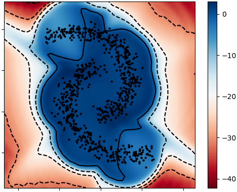

# Variational Autoencoders with Riemannian Brownian Motion Priors
<p float="left">
  
   
</p>


Code for the paper [Variational Autoencoders with Riemannian Brownian Motion Priors](https://arxiv.org/abs/2002.05227) \
by Dimitris Kalatzis, David Eklund, Georgios Arvanitidis, and Søren Hauberg

## Models and data sets
The model proposed in the paper is a VAE with a Riemannian Brownian motion prior (RVAE) and the experimental baselines are (a) a vanilla [VAE](https://arxiv.org/abs/1312.6114) with a standard Gaussian prior and (b) a [VAE with a VampPrior](https://arxiv.org/abs/1705.07120).

The datasets used in the experiments are MNIST and FashionMNIST.

## Running the code
### Installing the project package
To run the code, first you will have to install the project as a package. To do so,
simply navigate to the project directory and run:

```
pip install .
```

If you intend to modify the code then run the following to avoid having to
reinstall the package every time you modify it:

```
pip install -e .
```

### Running the experiments
The main script for running the experiments is `./experiments/run_experiments.sh`.
The logic of the experiments is in `./experiments/experiment.py` and `./experiments/run.py`
simply parses the command line arguments and runs the experiment, so you will likely want 
to look at these as well if you want to modify the code.

To run the experiments simply navigate to `./experiments` and run `./experiments/run_experiments.sh` 
with the following options:

`-m` -- the model, one of {`"RVAE", "VAE"`} \
`-d` -- the dataset, one of {`"mnist", "fmnist"`} \
`-l` -- the dimension of the latent variable \
`-c` -- the components of the VampPrior, set 1 for a vanilla VAE, will default to 1 in the case of RVAE

For example
```
sh run_experiments.sh -m RVAE -d fmnist -l 10 -c 1
```
will run the FashionMNIST experiment for RVAE with a 10-dimensional latent variable.

## Acknowledgements
Part of the code was lifted verbatim from https://github.com/jmtomczak/vae_vampprior

A big thank you to the author!
